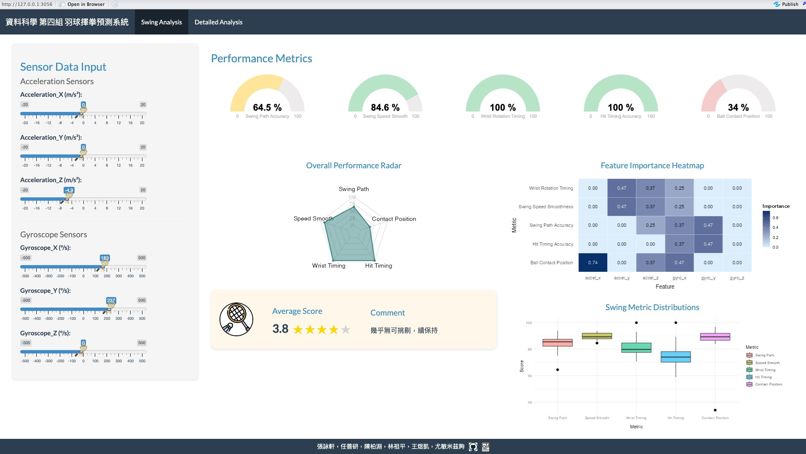

# [Group 4] 羽球技巧精進以及時間序列分析
- 近年來運動技巧的訓練逐漸轉向科學化靠攏，結合本身資訊的專業與運動結合，隨時隨地進行學習，幫助選手提升表現。

- 整合穿戴式裝置，利用其提供的 API 來量測使用者的揮拍動作，包括各方向的加速度和角速度。進行進一步的分析和評估，以提供更精確、個人化的技術指導。

- 本研究使用 Fitbit 穿戴式裝置並搭配時間序列資料分析羽球揮拍。目標是提供一般人可用的科學化揮拍分析方法。

## Contributors
|組員|系級|學號|工作分配|
|-|-|-|-|
|張詠軒|資訊碩二|112753207|資料搜集 資料處理 模型訓練 投影片 報告| 
|任善研|資管大三|111306095|資料處理 模型比較|
|陳柏淵|資訊碩一|113753140|前端介面|
|林祖平|國貿大四|110301015|投影片 海報 文件|
|王煜凱|資訊大三|111703053|前端介面|
|尤敏米茲夠|資訊碩一|113753220|前端介面|

## Demo Link
https://oscarwyk.shinyapps.io/finalproject-group-4/

## File structure 
### docs
  * 1132_DS-FP_group4.pdf

### data
* label
  * label_and_comments.xlsx
* data
  * time_series_data_csv

### code
* code
  * convert_txt_to_csv.py
  * extract_swing_features.r
  * frontend.R
  * load_and_process_data.r
  * main_with_null_model.py
  * main.py
  * main.r

### results
* model
  * multi_target_model.pkl
  * scaler.pkl
* null_model_accuracy
  * null_modle.txt

## Overview
- 利用 Fitbit 穿戴式裝置收集運動資料（加速度與角速度）
- 處理時間序列資料去取得揮拍特徵

- 預測以下五項指標分數：
  - 揮拍路徑準確度（Swing Path Accuracy）
  - 揮拍速度流暢度（Swing Speed Smoothness）
  - 手腕旋轉時機準確度（Wrist Rotation Timing Accuracy）
  - 擊球時機準確度（Hit Timing Accuracy）
  - 擊球位置準確度（Ball Contact Position Accuracy）

## Method
### Data collection
#### 原始資料蒐集：
- Fitbit 裝置以約 203Hz 取樣率蒐集資料
#### 六組資料：
- acc_x, acc_y, acc_z（加速度）
- gyro_x, gyro_y, gyro_z（角速度）

### Feature extraction
目標是將一整段時間序列感測資料（含加速度與角速度）切成多個揮拍段，再將每段揮拍的原始資料轉換為七個數值特徵
- max_v （加速度最大值）
- mean_v（平均揮拍加速度）
- max_w（角速度）
- accel_time （前段加速時間）
- decel_time（後段減速時間）
- v_peak_time（速度高峰時機）
- w_integral（手腕穩定性）

### Model training
- 使用 RandomForestRegressor 建立多目標回歸模型
- 標籤來源為專家評分的五項指標
- 資料切分：訓練 80%，測試 20%
- 特徵標準化：使用 StandardScaler
- 評估指標：RMSE (均方根誤差)

### Real-time prediction
- 使用者輸入六項運動資料：vx, vy, vz, wx, wy, wz
- 即時計算特徵並導入至模型
- 輸出五項 0～5 分的評分
- 模擬如同教練給予的即時評價回饋

## Visualization Interface
- 直觀的操作儀表板展示
- 感測器輸入值
- 即時揮拍評分
- 評分趨勢變化圖
- 標示需要改善的項目
- 目標是協助使用者自我診斷與精進技巧

## Null model vs Ours

## Results
### Current and future
- 隨機森林模型無法捕捉時間動態變化
- 未來可能的改進方向：
  - 時序模型：引入 LSTM 等模型捕捉動態
  - 資料增強：加入高斯噪聲提升泛化能力
  - 特徵交互：加入速度與角速度交互項
  - 自適應學習：針對使用者調整個別模型

- 雖然時間序列分析不如影像處理精確但其具有便利性、低成本等優點若搭配平台化使用與持續資料累積

- 可打造個人化模型幫助自學者更有效率進步，正確揮拍同時減少受傷風險

## References
* Cryer, J. D., & Chan, K.-S. (2008). Time series analysis with applications in R (2nd ed.). Springer.
